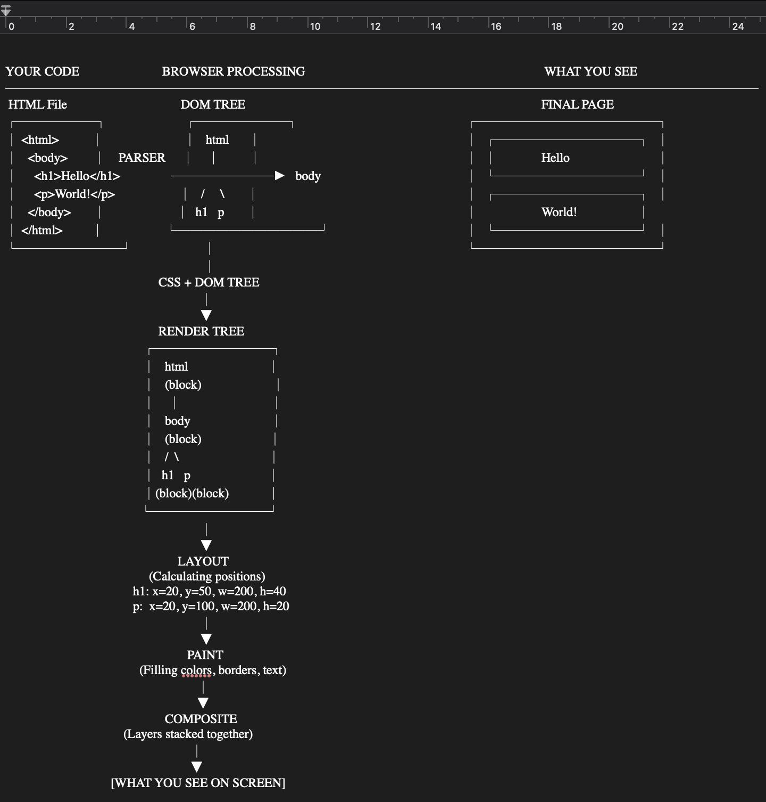

# PART 1 - REFLECTION JOURNAL

## CLASS 01 - The 2026 Web Ecosystem
## Theory
### Question 1.

The browser takes the HTML and CSS code, passing it through a seires of processes to finally produce what we see on the screen (Rendering). The browser reads the HTML text, breaks it down and converts it into what is called nodes and connects them into a tree structure called the DOM Tree (Document Object Model). The browser does the same thing with the CSS files, but this time it builds a CSSOM (CSS Object Model). The browser takes the DOM (the structure) and the CSSOM (the styles) merging them together to form the Render Tree. This tree only contains the things that actually need to appear on the screen. For tthhe layout, the browser checks the screen size and the Render Tree, and calculates the exact location on the screen, width, and height for every single element. Finally, the browser acts like a painter, by filling in the actual pixels on the screen.
A knowledge of the web ecosystem is essential for the developer as he learns to load scripts much better as this will help the browser to load page faster. A knowledge of this also enables the developer to prevent lagging which results from unnecessary changing of the layout of the web page. With the knowledge of this, the developer also learns to use CSS properties like transform or opacity to ensure smooth animations. This ensures smooth and fast loading of the webpage.

### Question 2.
If we imagine the interent as a highway that delivers packages (data) between cities (computers), the TCP (HTTP/2) is a single lane road with strict checkpoint system while QUIC (HTTP/3) is a multilane highway with smart routing. With this analogy, it is easy to see that QUIC solves the problem of connection set up speed (fast connection set up). Also with TCP, a lost packet during transmission causes even other unrelated packets to wait while with QUIC, only the affeced packet is made to wait. With TCP, any drop in a connection and another connection taking over will result in all active services using that initial connection to all resart, but with QUIC, allactive services continue seamlessly even with changes in connection.

### Question 3.
A popular website that does not heavily use semantic HTML tags in its main user interface is Facebook. Instead, it relies on deeply nested <div> and <span> elements.
Non-semantic websites are easily recognizable from the fact that it is almost impossible for screen readers to navigate the website by jumping from one heading to the other orusing screen reader shortcut menus, since there are no well defined headings or <nav> elements.
Also, the accessibility of none semantic websites is poor. For instance, while using say assistive technologies to access a website, these technologies read codes strictly in the order they are written, as a result, you might have say a Sidebar content being read out inside a paragraph.

## Product Thinking

### Question 1
if we imagine that the blog is a recipe book in a giant library (a search engine, say Google). The librarian 
(Google's search engine) needs to quickly find the best recipes to recommend. 
Semantic HTML is like adding clear chapter titles, ingredient lists, and step-by-step instructions – it tells the librarian exactly what each part of the page contains. 
When we use tags like article, header, main, and aside, we are 
giving Google a structured map of our content. This helps search engines understand, trust, and rank our recipes higher. For instance, wrapping each recipe within an article tag  helps search engines like Google to instantly know this block is a complete, stand-alone recipe and recipes marked with article are more likely to get featured 
snippets and rich results, which can double your click-through rate.
Aslo, header groups the introductory content of a section, say a recipe from the actual recipe and this helps search engines display the correct title and description in search. The aside tag contains extra information related to the main content, like a sidebar. This helps search engines to easily identify and keep the main content of the blog fom extra information.

### Question 2
Let's imagine that that our multi player game server is like a pizza shop. If this shop is in another country, evey pizza ordered will take ages to arrive. This is a lag. Now, edge computing is like opening mini pizza shops (our game servers) in every city within the country thereby making the pizza arrive faster since it is now closer. Some of the benefits edge computing offers in this type of game are:

Vey Fast Response: /edge computing makes response to every player's click to be super fast and this is vey essential in a multi player game as any delay makes the game feels sluggish and unplayable.

Smooth gameplay, no freezes: Over the internet, packets can get lost and also, players connection can get sluggish. This can result in freezing in the game. With edge computing, when packets get lost or a player's connection becomes bad, the edge servers can predict movement, and keep the game world consistent for everyone. This is necessary as it makes even players with bad connection to have an awesome experience.

Real-time Cheat Detection: With one central server probably located far away, players can exploit any lag to cheat and avoid detection. With edge computing, the edge servers can detect any suspicious move and flag it before it even gets to the main server. This matters bevcause cheaters get caught instantly, not after the game ends, and this protects the integrity of the game.

## Engineering Best Practice

### Question 1.
I disagree with the approach of just using "divs", and here's why it matters beyond just "making it work."

Accessibility first: Screen readers used by visually impaired users rely on semantic HTML to navigate. When you use div for everything, a blind user hears just "div, div, div" which is completely meaningless. But, hearing header, nav, main, and article tells them exactly where they are on the page. Using just "divs" everywhere essentially locks out users with disabilities.

SEO impact: Search engines like Google prioritize semantic structure. An article tag signals "this is the main content worth giving attention to," while a "div class="article" carries no semantic weight. Your div-heavy site might rank on page 5 while a semantic competitor grabs page 1, costing real traffic and revenue.

Code maintainability: Say six months from now, you or a teammate might need to update that "div-filled" HTML. Finding where the main content starts means digging through say 15 nested divs. With semantic HTML, you easily scan for main and article, thereby solving the problem instantly.

Developer collaboration: When a new developer joins the team, semantic tags act as self-documenting code. They instantly understand page structure without guessing what a "div-filled" page with various classes means.

Additionally, using article over div cost nothing but save hours of debugging, improve accessibility, boost SEO, and make you a better teammate. "It works for everyone" is always better than  "it works for just you or a few".

## Class 02: Typography & Information Hierarchy
## Theory
### Question 1.

The em (emphasis) tag is used when you need to stress a word when speaking, and as for one using a screen reader, it changes tone/pitch (stress); whereas the i (idiomatic) tag is used when you need a different voice, mood, or category, whithout any change in tone (reads normally).

Fo example, let's say i have "I said I wanted **two** eggs, not three.", whee Iwanted the word "two" to be stressed;

`<p>I said I wanted <em>two</em> eggs, not three.</p>`

When the html above is endered, a screen reader will read it out stressing the word "two".

On the other hand, when we need a different voice or mood, but not to stress it, we use `<i>`. An exampleis in a movie. or book title.
`<p>My favorite series of all time is <i>24</i> featuring Kiefer Suderland.</p>`. Here, "24" will be read out with a different voicebut not stressed.

### Question 2.
3 HTML Elements With Special Screen Reader Behavior
1. `<button>` – "Button, Click to Activate"
The screen reader announces:

"Submit form, button" (reads the text, then announces it's a button)

Why the browser handles it this way:

The browser knows that a `<button>` is interactive and triggers an action. By announcing "button" after the label, the person using the screen reader understands:

✅ This is clickable

✅ Pressing Enter or Space will activate it

✅ It will perform an action (not navigate somewhere)

If you use a `<div>` as a button, the screen reader announces: "Submit" (just text). The user has NO idea it's clickable. They might sit there wondering what to do.

2. `<nav>` – "Navigation, List of Links"
WA screen reader announces:

"Navigation region, list, 5 items" (then reads each link)

Why the browser handles it this way:

The browser knows that `<nav>` contains site navigation, the primary way to move around your website. Screen readers offer a shortcut key (usually R or N) to jump directly to the navigation region.

What happens if you use `<div class="nav">`:

No region announcement.

No keyboard shortcut to jump to navigation.

The user must tab through EVERY link on the page one by one.

3. `` with alt attribute – "Image, [description]"

A screen reader announces (with good alt text):

"Image, golden brown jollof rice in a red bowl"

What a screen reader announces (with empty or missing alt):

"Image" (or worse, reads the filename: "img1 dot jpg")

Why the browser handles it this way:

The browser knows images are visual content that blind users cannot see. The alt attribute provides a text replacement. The screen reader announces "image" so the user knows it's a picture, not text.

### Question 3.
 When to Use ARIA Labels
ARIA is designed for complex custom widgets that HTML simply doesn't have built-in tags for.

A good Example is icon-only button (no visible text)

`<button aria-label="Delete recipe">
  🗑️
</button>`

Why this needs ARIA: A sighted user sees the trash icon and knows "delete." A screen reader sees only an emoji (which it might read as "waste basket" or just skip). The aria-label ensures the screen reader announces: "Delete recipe, button"

When to fix your HTML (not use Aria):

A golden rule is that semantic HTML is better than Aria.

Bad example Aria usage is using ARIA to fake a button:

`<div class="fancy-button" role="button" aria-label="Submit form" tabindex="0">
  Submit</div>`

The problem with the code above is that you have to. manually code many attibutes for the button, whereas simply using a semantic HTML `<button>Submit form</button>` automatically provides those attributes.

## Accessibility Reflection
### Question 1.

## Product Thinking
### Question 1.
This is a heading hierarchy that can be used for an API documentation page where developers need to scan quickly:

`<h1>` – API name + primary purpose
Example: "Nigerian Universities API – Search for Nigerian Universities and bsic information about them"

Why: Tells developers immediately what this API does and whether they're in the right place.

`<h2>` – Major sections (the "table of contents" of functionality)
Authentication – How to get API keys and tokens

Endpoints – All available URLs grouped by resource

Request examples – Sample cURL, JavaScript, Python code

Response format – What data comes back (JSON structure)

Error codes – What goes wrong and how to fix it

`<h3>` – Specific endpoints or subsections under each `<h2>`:

`<h3>` POST /v1/name – Initialize a search by name

`<h3>` GET /v1/verify/{reference} – Cross check with officaldata from NUC

`<h3>` GET /v1/details – Get University information

Under `<h2>` Error codes:

`<h3>` 400 Bad Request – Missing or invalid parameters

`<h3>` 401 Unauthorized – Invalid API key

## Class 03 Modern Assets & Linking
## Theory
### Question 1.
Step 1: Question the format immediately
Reasoning: PNG is for graphics with transparency, not photographs. A hero image is likely a photo; PNG is the wrong choice (5 MB is massive).

Step 2: Convert PNG to WebP or AVIF
Tools: Squoosh.app (free, browser-based) or ImageMagick CLI

What to do:

Try AVIF first (best compression in 2026 – supported by 97% of browsers)

Fallback to WebP (99% browser support)

Result: 5 MB PNG reduced to ~300-500 KB AVIF (90% size reduction, visually identical)

Reasoning: AVIF uses modern compression algorithms that preserve detail at tiny file sizes.

Step 3: Resize to responsive breakpoints
Tools: Sharp (Node.js), Cloudinary, or Imgix

What to do: Generate 3-4 sizes:

hero-640.jpg (mobile)

hero-1024.jpg (tablet)

hero-1600.jpg (desktop)

hero-2400.jpg (2x retina)

Reasoning: Sending a 2400px image to a 375px phone wastes bandwidth and slows load time.

Step 4: Compress with quality testing
Tools: ImageOptim (desktop) or Squoosh

What to do: Test quality settings:

Start at 75% quality

Reduce until visible artifacts appear

Stop just above that threshold

Step 5: Implement with `<picture>` element:

```
<picture>
  <source srcset="hero.avif" type="image/avif">
  <source srcset="hero.webp" type="image/webp">
  
</picture>
```
Reasoning: Browser picks the best format it supports. loading="eager" ensures hero loads immediately (not lazy-loaded).

Step 6: Add modern loading optimizations
fetchpriority="high" – Tells browser this image is critical

Preconnect to image CDN – dns-prefetch and preconnect

Set width/height attributes – Prevents layout shift (CLS)

In summary, we convert the PNG image to to AVIF at 75% quality, generate 4 responsive sizes, serve via `<picture>` with WebP fallback, and add fetchpriority="high" – shrinking 5 MB to 250 KB without visible quality loss.

### Question 2.
srcset allows you to provide multiple image versions and lets the browser choose the right one based on either screen width or pixel density, or both.

Mostly, we use srcset for:

Responsive images: Different screen sizes need different resolutions.

Art direction: Cropped mobile version vs full desktop version.

Retina displays	Serve 2x images to high-density screens.

Slow connections: Let browser choose smaller file if bandwidth is limited.

srcset is not to be used for icons, SVG graphics, or images that are always the same size.

Use case scenario: Mobile User with Slow Connection
Problem: A chef's blog has a hero image of jollof rice. The desktop version is 1200px wide, 500 KB.

A mobile user on 3G in Oshogbo: Phone screen is 375px wide. But without srcset, they download the same 1200px, 500 KB image, this takes about 10 seconds and user leaves before page loads.

However, with srcset:

```

```
The browser sees "the user's screen is 375px and on 3G", hence it downloads hero-small.jpg (only 80 KB). This loads in 1 second, and hence the user user stays, reads recipe, and most probably shares/recommends the post.

### Question 3.
In simple terms, rel="noopener" prevents a malicious website from taking over the page that opened it, just like making sure a stranger can't reach through your front door and grab your keys after you invite them in.

Security Vulnerability it solves:

Without noopener: When your site opens a link in a new tab (target="_blank"), that new tab gains partial control over your original page. As a result, a hacker could:

Redirect your page to a fake site.

Steal information from your page.

Run code pretending to be you.

With noopener: The new tab runs completely isolated – it can't touch your original page at all.

The rule of thumb is if you use target="_blank", ALWAYS add rel="noopener noreferrer", every single time, without exception.
```
<a href="https://example.com" target="_blank" rel="noopener noreferrer">
  Link text
</a>
```

##  Engineering Thinking
### Question 1.
The optimization strategy for50 product images
1. Format Choice
AVIF first, WebP fallback – 70-80% smaller than JPEG at same quality

2. Responsive Sizing
Generate 3 sizes per image:

product-200.jpg (thumbnail grid)

product-600.jpg (hover/modal view)

product-1200.jpg (full detail)

Serve via srcset – browser picks right size for screen

3. Lazy Loading

``

Result: Only 4-6 images load initially (above fold). Remaining 44+ load as user scrolls.

4. CDN Delivery
Use Cloudinary, Imgix, or your host's CDN – images cached on servers near each user (Lagos, London, New York, etc.) instead of traveling from your single origin.

The final result is that before optimization, we have say 50 × 500 KB images = 25 MB page which have a load time of say more than 12 seconds, thereby user might leave without buying. However after optimization, we have a 50 × 50 KB = 2.5 MB page which loads in 2 seconds thereby making the user to stay.

In summary, we serve AVIF thumbnails via CDN with loading="lazy" and srcset for responsive sizes, thereby cutting page weight by 90% while images retain their quality.

## Class 04 Modern Forms & User Experience
## Theory
### Question 1.

Client-Side-only Validation
Flow:
When user types an invalid email and clicks submit, JavaScript blocks submission, shows red "Invalid email" instantly and the page never refreshes

However, the user can disable JavaScript (or use DevTools), and as a. result, validation never runs. Hence, bad data hits your server which can lead to database corruption, spam, or errors.

Server-Side-only Validation
Flow:
When the user types an invalid email and clicks submit, the page refreshes, server rejects it and sends back entire page with error message. The user waits some seconds to learn they made an error in the email.

However, the problem is slow feedback, poor user experience, extra server load, resulting in user frustration.

The right way is both client-side and server-side validation
Flow:

Client-side (instant): here, JavaScript validates before submit, "Invalid email" shows immediately.The user then fixes the error in seconds and form submits clean data.

Server-side (security): Even if client validation passes, server re-validates, and anyone bypassing JavaScript is caught.Server returns 400 error with message.

Why Both Are Required
Without forms of validation, client-side user experience willbe slow, resulting in frustrating forms.

Also, there will be server-side	security and data integrity	breach, attacks, and corrupt data.

In summary, client-side validation gives instant feedback for good user experience, server-side validation prevents bad data from reaching your database. Both is required because users can bypass JavaScript, but they shouldn't have to wait for too long to fix an error in email.

### Question 2.
The autocomplete attribute tells the browser what type of information belongs in a form field.This enables the browsser to automatically fill it with saved user data like passwords, addresses, payment info, and so on.

<table style="border-collapse: collapse; width: 100%;"> 
  <thead> 
    <tr style="border-bottom: 2px solid #ddd;"> 
      <th style="padding: 8px; text-align: left;">Value</th> 
      <th style="padding: 8px; text-align: left;">When to Use</th> 
      <th style="padding: 8px; text-align: left;">Real Form Example</th> 
    </tr> 
  </thead> 
  <tbody> 
    <tr style="border-bottom: 1px solid #ddd;"> 
      <td style="padding: 8px;">names</td> 
      <td style="padding: 8px;">User's full name</td> 
      <td style="padding: 8px;">Registration, checkout, contact forms</td> 
    </tr> 
    <tr style="border-bottom: 1px solid #ddd;"> 
      <td style="padding: 8px;">email</td> 
      <td style="padding: 8px;">Email address</td> 
      <td style="padding: 8px;">Login, newsletter signup, password reset</td> 
    </tr> 
    <tr style="border-bottom: 1px solid #ddd;"> 
      <td style="padding: 8px;">postal-code</td> 
      <td style="padding: 8px;">Zip/postal code</td> 
      <td style="padding: 8px;">Shipping calculator (Lagos: "100001", Abuja: "900001")</td> 
    </tr>
    <tr style="border-bottom: 1px solid #ddd;"> 
      <td style="padding: 8px;">off</td> 
      <td style="padding: 8px;">Disable autocomplete entirely	</td> 
      <td style="padding: 8px;">Sensitive fields (government ID numbers, medical forms)</td> 
    </tr>
    <tr style="border-bottom: 1px solid #ddd;"> 
      <td style="padding: 8px;">tel</td> 
      <td style="padding: 8px;">Phone number</td> 
      <td style="padding: 8px;">Delivery notifications, OTP verification (Nigeria: "Enter 0803...")</td> 
    </tr> 
  </tbody> 
</table>

## Product Thinking
### Question 1.
The core strategy is to use localStorage as draft auto-Save.
1. Automatic progress saving using localStorage.

After each step, data is saved automatically to localStorage. A code snippet that can be used to achieve this is shown below:

`form.addEventListener('input', () => {
  localStorage.setItem('jobAppDraft', JSON.stringify(formData));
});`

Now, when user loses internet at step 4, all data is already saved in their browser, no data is lost. When connection resumes, browser detects online event and restores draft from localStorage.

2. Validation Strategy

<table style="border-collapse: collapse; width: 100%;"> 
  <thead> 
    <tr style="border-bottom: 2px solid #ddd;"> 
      <th style="padding: 8px; text-align: left;">Validation Type</th> 
      <th style="padding: 8px; text-align: left;">When It Runs</th> 
      <th style="padding: 8px; text-align: left;">Why</th> 
    </tr> 
  </thead> 
  <tbody> 
    <tr style="border-bottom: 1px solid #ddd;"> 
      <td style="padding: 8px;">Client-side</td> 
      <td style="padding: 8px;">On each field (real-time)</td> 
      <td style="padding: 8px;">Catches errors instantly, saves clean data to localStorage</td> 
    </tr> 
    <tr style="border-bottom: 1px solid #ddd;"> 
      <td style="padding: 8px;">Server-side</td> 
      <td style="padding: 8px;">Only on final submission	</td> 
      <td style="padding: 8px;">Prevents corrupted submissions</td> 
    </tr> 
  </tbody> 
</table> 

The key decision here is that internet should not be required to validate. Client-side validation works offline. Server validation only happens when you submit the complete form.

3. Error Messaging
Clear error messages should be sent when user clicks "Next" without internet:

❌ "You're offline. Your progress is saved locally. Continue filling out the form – we'll submit when your connection returns."

Also, an error messagewWhen user tries to submit final step offline:

⚠️ "No internet connection. Your application is saved. We'll automatically submit when you reconnect."

### Question 2.
The table below shows when to use use native `<select>` and the reasons, considering accessibility, mobile UX, development time, and edge cases:

<table style="border-collapse: collapse; width: 100%;"> 
  <thead> 
    <tr style="border-bottom: 2px solid #ddd;"> 
      <th style="padding: 8px; text-align: left;">Factor</th> 
      <th style="padding: 8px; text-align: left;">Why</th> 
    </tr> 
  </thead> 
  <tbody> 
    <tr style="border-bottom: 1px solid #ddd;"> 
      <td style="padding: 8px;">Mobile users</td> 
      <td style="padding: 8px;">	iOS/Android show native wheel picker (easier than tiny custom options)</td> 
    </tr> 
    <tr style="border-bottom: 1px solid #ddd;"> 
      <td style="padding: 8px;">Simple selection</td> 
      <td style="padding: 8px;">Pick one option from a list (countries, quantity, year)</td> 
    </tr>
    <tr style="border-bottom: 1px solid #ddd;"> 
      <td style="padding: 8px;">Development speed</td> 
      <td style="padding: 8px;">1 line of code, zero JavaScript, works instantly</td> 
    </tr>
    <tr style="border-bottom: 1px solid #ddd;"> 
      <td style="padding: 8px;">Accessibility</td> 
      <td style="padding: 8px;">Free screen reader support, keyboard navigation, focus management</td> 
    </tr>
    <tr style="border-bottom: 1px solid #ddd;"> 
      <td style="padding: 8px;">Large lists</td>
      <td style="padding: 8px;">Native handles 100+ options without performance issues</td>
    </tr> 
  </tbody> 
</table> 

The table below shows when to use use custom dropdown and the reasons, considering accessibility, mobile UX, development time, and edge cases:

<table style="border-collapse: collapse; width: 100%;"> 
  <thead> 
    <tr style="border-bottom: 2px solid #ddd;"> 
      <th style="padding: 8px; text-align: left;">Factor</th> 
      <th style="padding: 8px; text-align: left;">Why</th> 
    </tr> 
  </thead> 
  <tbody> 
    <tr style="border-bottom: 1px solid #ddd;"> 
      <td style="padding: 8px;">Search required</td> 
      <td style="padding: 8px;">Say over 50 countries? User needs to type to filter</td> 
    </tr> 
    <tr style="border-bottom: 1px solid #ddd;"> 
      <td style="padding: 8px;">Multi-select with checkboxes</td> 
      <td style="padding: 8px;">Native multi-select is clunky (requires Ctrl+click)</td> 
    </tr>
    <tr style="border-bottom: 1px solid #ddd;"> 
      <td style="padding: 8px;">Custom styling required</td> 
      <td style="padding: 8px;">Brand colors, animations, icons inside options</td> 
    </tr>
    <tr style="border-bottom: 1px solid #ddd;"> 
      <td style="padding: 8px;">Complex option content</td>
      <td style="padding: 8px;">Images, descriptions, or HTML inside each option</td>
    </tr> 
  </tbody> 
</table> 

Acomparison table between native `<select>` and custom dropdown considering accessibility, mobile UX, development time, and edge cases is shown below:

<table style="border-collapse: collapse; width: 100%;"> 
  <thead> 
    <tr style="border-bottom: 2px solid #ddd;"> 
      <th style="padding: 8px; text-align: left;">Factor</th> 
      <th style="padding: 8px; text-align: left;">Native select</th> 
      <th style="padding: 8px; text-align: left;">Custom Dropdown</th> 
    </tr> 
  </thead> 
  <tbody> 
    <tr style="border-bottom: 1px solid #ddd;"> 
      <td style="padding: 8px;">Mobile UX</td> 
      <td style="padding: 8px;">Native wheel picker</td> 
      <td style="padding: 8px;">Tiny tap targets</td> 
    </tr> 
    <tr style="border-bottom: 1px solid #ddd;"> 
      <td style="padding: 8px;">Accessibility	</td> 
      <td style="padding: 8px;">Free (ARIA built-in)</td> 
      <td style="padding: 8px;">Requires manual ARIA</td> 
    </tr> 
    <tr style="border-bottom: 1px solid #ddd;"> 
      <td style="padding: 8px;">Development time</td> 
      <td style="padding: 8px;">1 minute</td> 
      <td style="padding: 8px;">2-4 hours</td> 
    </tr>
    <tr style="border-bottom: 1px solid #ddd;"> 
      <td style="padding: 8px;">Edge cases</td> 
      <td style="padding: 8px;">Handled by browser</td> 
      <td style="padding: 8px;">You manage everything</td> 
    </tr>
  </tbody> 
</table>

## Class 05 The CSS Engine — Box Model & Specificity
## Theory
### Quesiton 1.

<div style=" 
  background: #f9e79f;  
  padding: 30px;  
  text-align: center;  
  font-family: sans-serif; 
  border: 2px dashed #b7950b; 
  margin: 20px; 
"> 
  <div style=" 
    background: #abebc6;  
    padding: 20px; 
    border: 4px solid #27ae60; 
  "> 
    <div style=" 
      background: #d5f5e3;  
      padding: 15px; 
      border: 2px dashed #1e8449; 
    "> 
      <div style=" 
        background: #ffffff;  
        padding: 20px;  
        border: 1px solid #333; 
      "> 
        <strong>CONTENT</strong><br> 
        <span style="font-size:0.8em;">(The actual element)</span> 
      </div> 
      <span style="font-size:0.7em; color:#1e8449;">PADDING</span> 
    </div> 
    <span style="font-size:0.7em; color:#27ae60;">BORDER</span> 
  </div> 
  <span style="font-size:0.7em; color:#b7950b;">MARGIN</span> 
</div> 

When you have two adjacent divs of margin-bottom: 20px and margin-top: 30px, the space between them will be 30px. This is beacuase a ***margin collapse*** will occur between them. Margin Collapse – When two vertical margins touch, they merge (collapse) into the larger margin. The smaller margin essentially disappears. The rule of thumb is that adjacent block elements share vertical margins, we take the maximum, not the sum.

### Question 2.
The CSS specificity hierarchy is explained in a tabular form from highest to lowest as shown below:

<table style="border-collapse: collapse; width: 100%;"> 
  <thead> 
    <tr style="border-bottom: 2px solid #ddd;"> 
      <th style="padding: 8px; text-align: left;">Selector Type</th> 
      <th style="padding: 8px; text-align: left;">Example</th> 
      <th style="padding: 8px; text-align: left;">Specificity</th> 
    </tr> 
  </thead> 
  <tbody> 
    <tr style="border-bottom: 1px solid #ddd;"> 
      <td style="padding: 8px;">Inline styles</td> 
      <td style="padding: 8px;">style="color: red"</td> 
      <td style="padding: 8px;">1,0,0,0</td> 
    </tr> 
    <tr style="border-bottom: 1px solid #ddd;"> 
      <td style="padding: 8px;">ID</td> 
      <td style="padding: 8px;">#header</td> 
      <td style="padding: 8px;">0,1,0,0</td> 
    </tr> 
    <tr style="border-bottom: 1px solid #ddd;"> 
      <td style="padding: 8px;">Class, attribute, pseudo-class</td> 
      <td style="padding: 8px;">.nav, [type="text"], :hover</td> 
      <td style="padding: 8px;">0,0,1,0</td> 
    </tr>
    <tr style="border-bottom: 1px solid #ddd;"> 
      <td style="padding: 8px;">Element, pseudo-element</td> 
      <td style="padding: 8px;">	div, a, ::before</td> 
      <td style="padding: 8px;">0,0,0,1</td> 
    </tr>
  </tbody> 
</table>

Using the specificity hierarchy given above, we can calculate the specificities of the given selectors as shown below:

Selector 1: .header nav ul li a

.header (class) = (0,0,1,0)

nav (element) = (0,0,0,1)

ul (element) = (0,0,0,1)

li (element) = (0,0,0,1)

a (element) = (0,0,0,1)
────────────────────────────────

TOTAL:      (0,0,1,4)

Selector 2: nav a.active


nav (element) = (0,0,0,1)

a (element) = (0,0,0,1)

.active (class) = (0,0,1,0)

─────────────────────────────────

TOTAL:      (0,0,1,2)

Selector 3: .nav-links a

.nav-links (class) = (0,0,1,0)

a (element) = (0,0,0,1)

─────────────────────────────────

TOTAL:      (0,0,1,1)

From the calculation, we see that the first selector, .header nav ul li a, wins since it has the highest specificity of all the given selectors.

### Question 3.
The cascade in CSS refers to the set of rules that determines which CSS rule wins when multiple rules target the same element using cerrtain criteria like source order, specificity, and importance.
A simple situation where cascade helps writing unnecessary CSS is:

By default,alink (anchor tag) has a color of blue; i.e

a {
  color: blue;
}

Lets say we want the links in. our footer to be of color red, without cascade, we might have to say add a class, then override with !important;

.footer-link {
  color: red !important;
}

However with cascade, we just use a selector and let source order (and specificity) apply our styles:

footer a {
  color: red;
}

##  Engineering Thinking
### Question 1.
When you have an element of width of say 100px and you apply a padding of 10px, it suddenly appears wider than expected (specifically, 120px wide). The reason for this is that by default, "box-sizing: content-box" adds padding ***on top of*** the width.

Applied width = 100px
eneed width = applied width + padding-left + padding-right = 100px +10px + 10px = 120px

The fix for this is in pur element styling, we set the value of box-sizing to border-box;

box-sizing: border-box;

This ensures that the element takes up only the applied width without adding any applied padding to the width.

### Question 2.

<style> 
  .demo-container { 
    display: flex; 
    gap: 30px; 
    flex-wrap: wrap; 
    justify-content: center; 
    margin: 20px 0; 
  } 
  .box-wrapper { 
    text-align: center; 
    font-family: sans-serif; 
  } 
  .box { 
    width: 200px; 
    height: 100px; 
    padding: 25px; 
    border: 10px solid #333; 
    background: #e0f2fe; 
    margin: 10px auto; 
    position: relative; 
    /* The content area is where the text goes */ 
    color: #0c4a6e; 
    font-weight: bold; 
    display: flex; 
    align-items: center; 
    justify-content: center; 
  } 
  /* Default box-sizing: content-box (this is the browser default) */ 
  .content-box { 
    box-sizing: content-box; 
    background: #fef9c3;  /* light yellow to differentiate */ 
    border-color: #a16207; 
  } 
  /* border-box includes padding and border inside the declared width/height */ 
  .border-box { 
    box-sizing: border-box; 
    background: #dcfce7;  /* light green */ 
    border-color: #166534; 
  } 
  .label { 
    margin-bottom: 5px; 
    font-size: 0.9em; 
    font-weight: bold; 
  } 
  .dimensions { 
    font-size: 0.75em; 
    margin-top: 8px; 
    color: #444; 
    line-height: 1.5; 
  } 
</style> 
 
<div class="demo-container"> 
  <!-- CONTENT-BOX --> 
  <div class="box-wrapper"> 
    <div class="label">  content-box</div> 
    <div class="box content-box"> 
      <span>Content area<br>200×100 px</span> 
    </div> 
    <div class="dimensions"> 
      width: 200px<br> 
      padding: 25px (×2)<br> 
      border: 10px (×2)<br> 
      <strong>Total width = 200 + 50 + 20 = 270px</strong> 
    </div> 
  </div> 
 
  <!-- BORDER-BOX --> 
  <div class="box-wrapper"> 
    <div class="label">  border-box</div> 
    <div class="box border-box"> 
      <span>Content area<br>140×40 px</span> 
    </div> 
    <div class="dimensions"> 
      width: 200px<br> 
      padding: 25px (×2)<br> 
      border: 10px (×2)<br> 
      <strong>Total width = 200px (content shrinks)</strong> 
    </div> 
  </div> 
</div> 


## Class 06 Flexbox Mastery
## Theory
### Question 1.
Imagine a group of friends sharing a loaf of bread:

flex-basis: this is the initial slice every friend expects before any sharing or shrinking happens.

flex-grow: this is how much extra bread a friend gets if there is leftover.

flex-shrink: this is how much bread a firend gives up if the bread is smaller than expected.

### Question 2.
align-items: stretch; fails when the cross-axis item has a specified content height. It only works on items without a defined cross-axis size.

<style>
  .container {
  display: flex;
  align-items: stretch; /* Try to make all items equal height */
  height: 300px;
  background: #f0f0f0;
  gap: 10px;
}

.item3 {
  height: 100px; /* This blocks stretch */
  background: #e74c3c;
}

.item1, .item2 {
  background: #4a90e2;
}
</style>
<div class="container">
  <div class="item1">Hello World!</div>
  <div class="item2">This item has<br>three lines<br>of text</div>
  <div class="item3">I have a height</div>
</div>

## Engineering Thinking
### Question 1.

<style>
  .navbar {
  display: flex;
  align-items: center;
  justify-content: space-between; /* Pushes logo left, button right */
  background: #1a1a2e;
  padding: 1rem 2rem;
  color: white;
}

.logo {
  flex: 0 0 auto; /* Don't grow, don't shrink, auto width */
  font-weight: bold;
  font-size: 1.2rem;
}

.nav-links {
  display: flex;
  gap: 2rem;
  list-style: none;
  margin: 0;
  padding: 0;
  
  /* KEY: Makes nav-links take available space */
  flex: 1;
  
  /* Centers items inside the available space */
  justify-content: center;
}

.nav-links a {
  color: white;
  text-decoration: none;
}

.signin-btn {
  flex: 0 0 auto; /* Don't grow, don't shrink */
  background: #e94560;
  border: none;
  padding: 0.5rem 1.2rem;
  border-radius: 8px;
  color: white;
  cursor: pointer;
}
</style>
<nav class="navbar">
  <div class="logo">Web-Dev ChatApp</div>
  
  <ul class="nav-links">
    <li><a href="#">About</a></li>
    <li><a href="#">Tutors</a></li>
    <li><a href="#">Fellows</a></li>
    <li><a href="#">Blog</a></li>
    <li><a href="#">Contact</a></li>
  </ul>
  
  <button class="signin-btn">Sign In</button>
</nav>


## Class 07 CSS Grid & Layout Complexitys
## Theory
### Question 1.
The core difference between flexbox and grid is that flexboxis one-dimensional (either row OR column) whhile grid is two-dimensional (rows AND columns simultaneously).

Three Scenarios where grid is clearly the better tool:

1. Page Layout with Sidebar + Main Content

Example: Blog with header, sidebar (navigation), main content area, and footer.

2. Card Gallery with Consistent Heights

Examle: Product grid showing say 24 items, where each card has title, description, image, and button and descriptions vary in length.

3. Complex Overlapping Layouts

Example: Magazine-style hero section where text overlays an image, and at the same time sits beside another element.

In summary, we use grid for ***two-dimensional*** layouts where we control both rows and columns (page structure, card grids, overlapping elements); and use flexbox for one-dimensional distribution along a single axis (navigation bars, inline lists, centering a button).

### Question 2.
grid-template-areas is a visual layout mapping which lets you name grid cells and arrange them like a visual map without using numbers.

We use grid-template-areas when layout stability matters, where we have fixed regions with clear names (header, sidebar, footer). This is because it is self-documenting and very easily responsive.

## Engineering Thinking
### Question 1.
```
┌─────────────────────────────────────────────────────────────┐
│                                                             │
│                      HERO ARTICLE                           │
│                    (spans full width)                       │
│                                                             │
├───────────────────────────┬─────────────────────────────────┤
│                           │                                 │
│   SECONDARY ARTICLE 1     │     SECONDARY ARTICLE 2         │
│                           │                                 │
├─────────────────────────────────────────────────────────────┤
│                                                             │
│                    WIDE ARTICLE                             │
│                 (spans full width)                          │
│                                                             │
├─────────────┬─────────────────┬─────────────────────────────┤
│             │                 │                             │
│  Article 1  │    Article 2    │        Article 3            │
│             │                 │                             │
└─────────────┴─────────────────┴─────────────────────────────┘
```
```
.magazine {
  display: grid;
  grid-template-columns: 1fr 1fr;
  grid-template-areas: 
    "hero hero" 
    "secondary1 secondary2"
    "wide wide"
    "article1 article2 article3";
  gap: 20px;
}
```

The ***fr*** (fraction) unit is used when you need to distribute the remaining space proportionally. It has been used here because the hero and small articles share space flexibly.

The ***auto*** unit is used when you want content-sized columns (sidebar with exact text width). It is not needed in the example used above because all articles should grow/shrink together.

The ***percentages*** unit is used when you want fixed proportions relative to parent container. It is less flexible than ***fr*** with gaps; ***fr*** handles gaps automatically.

### Question 2.
Large Screen (Desktop):
```
┌──────────┬────────────────────┬────────────┐
│          │                    │            │
│ Sidebar  │    Main Content    │ Right      │
│ (auto)   │     (1fr)          │ Panel      │
│          │                    │ (auto)     │
└──────────┴────────────────────┴────────────┘
```
Medium Screen (Tablet):
```
┌────────────────────┬────────────┐
│    Main Content    │ Right      │
│     (1fr)          │ Panel      │
├────────────────────┴────────────┤
│         Sidebar (full width)    │
└─────────────────────────────────┘
```
Mobile (Collapsed Sidebar at Top):
```
┌──────────────────────────────────┐
│         Sidebar (auto)           │
├──────────────────────────────────┤
│         Main Content             │
├──────────────────────────────────┤
│         Right Panel              │
└──────────────────────────────────┘
```

```
.dashboard {
  display: grid;
  grid-template-columns: repeat(auto-fit, minmax(250px, 1fr));
  gap: 16px;
}
```

📝 Self-Assessment Template

Before this break, I knew…

1. How the web really works, rendering of our HTLM page.

2. HTML basics and styling with vanilla CSS.

3. Tailwind CSS basics and Introductory Javascript.

During this break, I learned…

1. Advanced layouts using CSS flexbox and grid.

2. Making responsive design with Tailwind CSS.

3. Javascript functions, arrowfunctions and DOM manipulation.


I'm still confused about…

1. Event loop and Promises

2. Application of Javascipt Promises in real life applications.


My growth areas…

1. Comfortable with HTML and CSS 

2. Effective styling using Tailwind CSS

3. Javascipt concepts and how to apply them in building simple applications.

One thing I'll do differently in the next project…

The only thing I will want to do differently in the next project, which really affected me in this project, and also was completely not within my power, is having more time to work on the project. It is not always like this, but in the last 6 weeks, I have had an impossible schedule at work with emergency installations that required us to work every single day of the week (MOndays to Sundays) from 8am till around 7pm. So I really hope this phase of work come to a completion soon so that I can dedicate much more time for the next poject.

